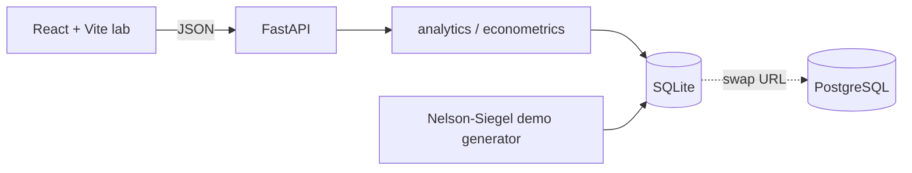

# POLICY → YIELDS

**Impact of Monetary Policy on Global Sovereign Bond Markets**

A student-built global fixed-income / macro research terminal for four markets — the United States, India, the United Kingdom, and the Eurozone (German Bund benchmark).

> Educational research project — **not investment advice**.  
> Default dataset is **SIMULATED DATA — FOR ANALYTICAL DEMONSTRATION**. It is never presented as a live vendor feed.

## Research question

How do changes in monetary policy affect sovereign bond yields, yield curves, volatility, term premia, and cross-market relationships?

The product hierarchy is intentional:

```text
MONETARY POLICY → POLICY RATE → SHORT-END YIELDS
        → YIELD CURVE → LONG-END YIELDS
        → BOND RETURNS / VOLATILITY
        → CROSS-MARKET TRANSMISSION
```

## Economic motivation

A central bank does not set the 10-year yield. It sets (or targets) an overnight rate and, sometimes, the size of its balance sheet. The rest of the curve is an argument among expected future short rates, inflation, growth, and a term premium that is **not directly observed**. This lab is a place to watch that argument play out with transparent formulas rather than a black-box “AI forecast”.

## Features

| Page | What it actually computes |
|---|---|
| Landing | Cinematic entry, four mini curves |
| Overview | KPIs, policy heatmap, policy vs 10Y, event markers, sample insights |
| Monetary policy | Four-column decision timeline, before/after 2s/10s/30s, regime averages |
| Yield curves | Nelson-Siegel demo curves, overlays, 2s10s, anatomy, “Guess the curve” |
| Cross-market | Comparison matrix, rolling/lag correlation, transmission nodes |
| Event study | Average path of 10Y around hikes/cuts/QE/QT |
| Bond returns | Constant-maturity TR, drawdowns, price–yield lab, duration vs convexity |
| Risk | Rolling vol, historical VaR (with a warning), Sharpe |
| Macro | Scatter + monthly OLS regression lab |
| Scenario | Linear elasticities, clearly labelled **not a forecast** |
| Research notes | Structured notebook + glossary + snapshot export |
| Methodology / Sources | Formulas, limitations, DEMO attribution |

Analyst / Learning mode toggles copy density. `⌘K` / `Ctrl+K` opens the command bar.

## Architecture



```
backend/app
  api/routes.py          REST
  analytics/             bond math, risk, scenario elasticities
  econometrics/          OLS, lags, event study
  data/generate_demo.py  historically inspired sandbox
  models/tables.py       SQLAlchemy (SQLite today, Postgres tomorrow)
frontend/src
  pages/                 one module per lab screen
  components/            shell, cards, charts, command bar
```

## Tech stack

- Frontend: React 18, TypeScript, Vite, Tailwind CSS, Recharts, Framer Motion, Lucide
- Backend: Python, FastAPI, pandas, NumPy, SciPy, statsmodels, Pydantic, SQLAlchemy
- Database: SQLite by default (`backend/policy_yields.db`). Set `DATABASE_URL=postgresql+psycopg2://...` to point at Postgres without changing models.

## Data sources

The application is **architected** for FRED, U.S. Treasury, RBI/CCIL, BoE/DMO, ECB SDW and Eurostat. The shipping dataset is a **deterministic sandbox** whose policy waypoints follow the publicly remembered 2015–2026 cycles (COVID ELB, 2022 hiking inversion, 2024–26 easing, UK LDI spike). Every screen labels it DEMO.

See **Data Sources** in the UI for variable, frequency, range, transformation, and methodology per series.

## Key formulas

**Price**  
\( P = \sum_{t=1}^{N} \frac{c}{(1+y/m)^t} + \frac{F}{(1+y/m)^N} \)

**Macaulay duration**  
\( D_{\mathrm{Mac}} = \frac{1}{P} \sum t \cdot \mathrm{PV}(CF_t) \)  (in years)

**Modified duration**  
\( D_{\mathrm{mod}} = D_{\mathrm{Mac}} / (1 + y/m) \)

**Nelson–Siegel**  
\( y(\tau)=\beta_0+\beta_1\frac{1-e^{-\tau/\lambda}}{\tau/\lambda}+\beta_2\left(\frac{1-e^{-\tau/\lambda}}{\tau/\lambda}-e^{-\tau/\lambda}\right),\ \lambda=1.4 \)

**Event study**  
Each path is \( 100\times(y_{t+k}-y_{t}) \) in bp, averaged across events that have a full window.

## How to run

```bash
# backend
cd backend
python -m venv .venv
# Windows: .venv\Scripts\activate
pip install -r requirements.txt
uvicorn app.main:app --reload --port 8000

# frontend (second terminal)
cd frontend
npm install
npm run dev
```

Open [http://localhost:5173](http://localhost:5173). API docs: [http://127.0.0.1:8000/docs](http://127.0.0.1:8000/docs).

First API boot creates SQLite (`backend/policy_yields.db`) and seeds DEMO data (a few seconds). Run backend commands **from the `backend` folder** so the database file resolves correctly.

On Windows, this project folder name contains `&`, which can break `npm run dev` / `cmd.exe` chaining. From `frontend/`:

```powershell
node .\node_modules\vite\bin\vite.js --host 127.0.0.1 --port 5173
```

Or use `.\run.ps1 web` from the repo root.

### Tests

```bash
cd backend
pytest -q
```

Coverage includes bond pricing, duration/convexity identities, spreads/regimes, OLS recovery, VaR/drawdown, scenario elasticities, and HTTP endpoints.

### Demo mode

`DEMO_MODE=true` by default (`backend/app/config.py`). There is no silent substitution of unrelated series: if an endpoint cannot build a window it returns an explicit empty/error payload.

## API (selected)

| Method | Path | |
|---|---|---|
| GET | `/api/markets` | Four markets + central banks |
| GET | `/api/overview` | KPIs, heatmap, insights |
| GET | `/api/series` | Policy vs yields + event markers |
| GET | `/api/yield-curve` | Curve + overlays + shape |
| GET | `/api/event-study` | Average path |
| POST | `/api/regression` | Monthly OLS |
| POST | `/api/scenario` | Illustrative elasticities |
| POST | `/api/bond-lab` | Price, duration, convexity |
| GET | `/api/sources` | Attribution table |

## Limitations

- Sandbox data, not FRED/RBI/BoE/ECB prints.
- Term premium is **conceptual**, not ACM-estimated.
- OLS uses classical standard errors (autocorrelation likely).
- Event counts are small by design.
- Scenario engine is linear and pedagogical.
- Eurozone = Bunds, not a weighted euro sovereign index.
- Constant-maturity returns are not a vendor TR index.

## Future improvements

- Optional FRED / ECB SDW ingest behind API keys, still labelled by source.
- HAC / Newey–West standard errors and a simple break test.
- ACM-style term premium (with a huge identification caveat).
- PNG export of a chart via `html-to-image` on a chosen `ChartFrame`.
- PostgreSQL in docker-compose for multi-user demos.

## License

Built as a university / internship-portfolio project. Use and fork freely; do not ship the DEMO series as market data.
